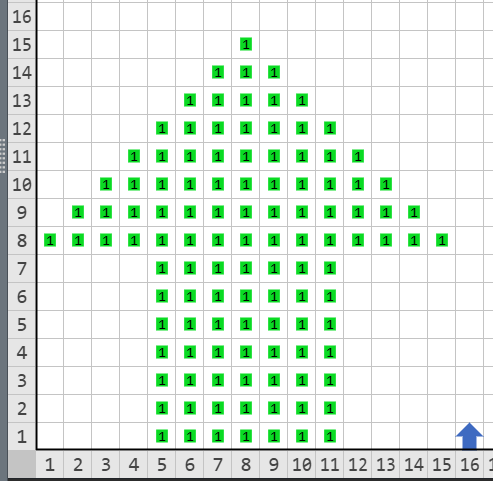
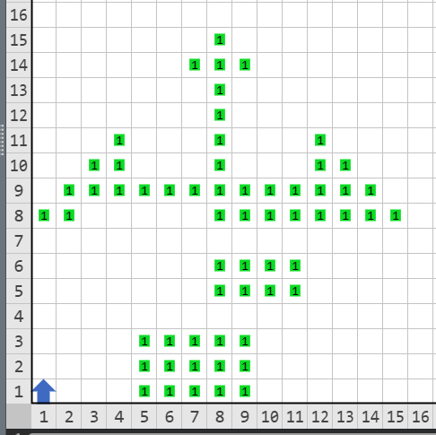

# BASE DESCONOCIDA

Karel lleva 20 años en la OMI, a lo largo de estos ha crecido y tenido actualizaciones, Karel-blanco, Karel-azul, Karel-js, sin embargo, su naturaleza sigue intacta. Karel se pregunta si puede ser algo más, más útil, más versátil, más poderoso.

Dispuesto a descubrir su verdadero potencial, Karel se embarcó en un viaje en busca de sus orígenes. Siguiendo pistas que encontró en la red oscura, llegó hasta una antigua base en medio de la selva. De inmediato supo que esa base era de sus antepasados, ya que no era una simple pirámide, sino que se alcanzaba a percibir algo como una flecha, idéntica a él, pero mucho más grande.

Siguió los manuscritos que encontró en la biblioteca de Kareljandría para darse cuenta que, originalmente, la base era una flecha de 15x15.

Y que la única forma de entrar y seguir descubriendo los misterios era reconstruyéndola.

Por eso Karel te ha pedido que reconstruyas la base. Se te asegura que hay una única solución.

## Problema

Dados zumbadores en el mundo, reconstruye la base con las dimensiones especificadas. Se te asegura que solo hay una forma de ponerla.

## Ejemplo

Entrada:

Salida:

## Consideraciones

* Karel inicia en la casilla 1x1 con infinitos zumbadores en la mochila.
* El mundo es un cuadrado de 30x30 rodeado por paredes sin paredes internas.
* En cada casilla del mundo sólo hay 0 o 1 zumbadores.
* No importa la orientación ni posición final de Karel.
* La salida debe ser una flecha de montones de un zumbador de 15x15 no debe haber zumbadores fuera de la base.

## Subtareas

* **Subtarea 1 (20 puntos):** se te asegura que el pico de la estatua estará en la casilla 8x15.
* **Subtarea 2 (20 puntos):** se te da la base (la primera fila de la estatua) completa.
* **Subtarea 3 (20 puntos):** Habrá dos zumbadores, el del pico y alguno de la primera fila de la estatua.
* **Subtarea 4 (40 puntos):** Sin restricciones adicionales.