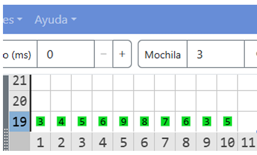
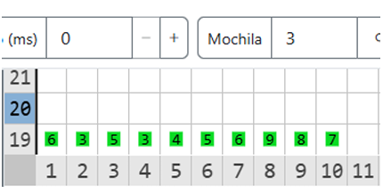

# Rotación

## Historia

Gracias a su viaje, Karel se ha dado cuenta que hay mucho más en él de lo que él mismo sabía. No sólo en su pasado, sino también en su futuro. Karel está decidido a salir de la base y liberar su máximo potencial, a convertirse en ReKarel.

Ahora, lo único que tiene que hacer es salir de la base. Suena fácil, pero como siempre hay algo que se interpone en el camino. En este caso, es una puerta de combinación. 

Para poder abrir la puerta, Karel debe escribir una secuencia de números. Por suerte en uno de los códices de la base, Karel encontró escrita dicha secuencia. Desgraciadamente, está recorrida **N** posiciones y para poder usarla, Karel deberá rotarla.

Si se tiene la secuencia `A = [3, 5, 6, 1]`, al rotarla 1 posición a la derecha quedará como sigue: `A_rotada = [1, 3, 5, 6]`.

## Problema

La primera fila del mundo de Karel contiene la lista de números que aparece en el códice. Karel lleva **N** zumbadores en la mochila. Escribe un programa que deje en la primera fila del mundo la secuencia resultante luego de hacer **N** rotaciones a la derecha.

## Entrada y Salida

Entrada:

Salida:

#### Descripción de la Entrada

En la imagen de ejemplo se aprecia que Karel lleva 3 zumbadores en la mochila, eso quiere decir que la secuencia de números debe ser rotada 3 posiciones a la derecha.

La secuencia inicial es:
`[3, 4, 5, 6, 9, 8, 7, 6, 3, 5]`

Al rotarla 3 posiciones a la derecha se obtiene:
`[6, 3, 5, 3, 4, 5, 6, 9, 8, 7]`

## Consideraciones

* Karel inicia en la posición (1, 1) viendo al norte.
* Karel lleva **N** zumbadores en la mochila.
* El mundo de Karel tiene 100 columnas de ancho.
* El mundo puede tener una altura que va desde 1 hasta 100.
* Los montones de zumbadores pueden ir del 1 al 99.
* **N** < 1000. Es decir, **N** puede ser mayor a la cantidad de números en la secuencia.
* La primera fila del mundo contiene montones de zumbadores que representan los números de la secuencia.
* No hay espacios entre los montones y estos pueden llegar hasta la pared este del mundo.
* Para obtener los puntos, tu programa deberá dejar, en la primera fila del mundo, la lista de números rotada **N** posiciones. **No deberá haber ningún otro zumbador en el mundo.**

## Subtareas

En este problema, los casos de cada subtarea se encuentran agrupados. Para obtener el puntaje de una subtarea deberás resolver correctamente todos los casos del grupo.

* **Subtarea 1 (25 puntos):** **N** = 1
* **Subtarea 2 (25 puntos):** El alto del mundo es 1, la cantidad de números es exactamente 100 y **N** < cantidad de números.
* **Subtarea 3 (25 puntos):** El alto del mundo es 1, la cantidad de números es $\le$ 90 y **N** < cantidad de números.
* **Subtarea 4 (25 puntos):** El mundo de Karel tiene 1 fila de alto.