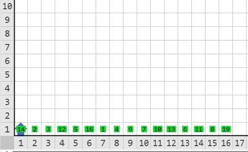
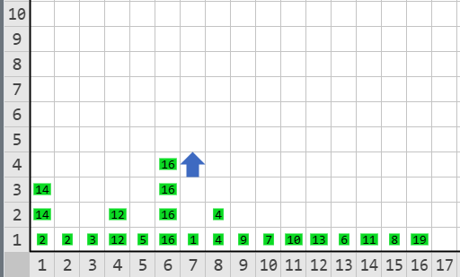

# EL TORNEO DE LAS RAZAS

Tras atravesar el pasillo, Karel llega a un gran salón. Sus paredes se encuentran cubiertas con códices que cuentan la historia de los Karels. Karel descubre que ha habido múltiples razas de Karels previas a él, todas creadas para difundir las ciencias computacionales en el mundo. 

Uno de los códices describe las Karelimpiadas, un antiguo torneo en dónde los Karels se enfrentaban y medían sus habilidades. Karel sabe que sus antepasados directos participaron en esta olimpiada, pero desconoce qué tan exitosos eran en comparación con las demás razas. Conocer su nivel lo ayudaría a continuar explorando la base ya que ésta estaba adaptada para habilidades de distintas razas. (Si Karel pasea por pasillos que no están diseñados para él, no será capaz de detectar todas las trampas y morirá).

En la habitación Karel encontró anotados los puntos de habilidad de cada raza y el rol de competencias del torneo, pero al parecer, ocurrió algo que imposibilitó la finalización del mismo. Por eso, Karel te pide que determines cuántas partidas habrían ganado sus ancestros durante este torneo. 

El torneo seguía las reglas de una eliminación simple en la que dos participantes se enfrentaban y aquel con menor puntaje quedaba eliminado. Escribe un programa que le ayude a Karel a determinar el número de partidas que habría ganado su ancestro.

## Problema

La primera fila del mundo contiene una lista de **N** zumbadores. **N** es una potencia de 2 y los valores de los montones son todos distintos entre sí. 

Los montones de zumbadores representan el nivel de habilidad de cada raza y el torneo se lleva a cabo de forma que en la primera ronda se enfrentan los karels de las posiciones (1, 2), (3, 4), (5, 6), etc. En la segunda ronda se enfrenta el ganador de la pareja (1, 2) con el de la (3, 4); el ganador de la (5, 6) con el de la (7, 8) y así sucesivamente, las razas se van enfrentando en orden según su posición inicial. (Revisa la imagen de ejemplo para más detalle).

El ancestro de Karel está representado por el montón en la casilla (1, 1).

Escribe un programa que ayude a Karel a determinar la cantidad de partidas que habría ganado su ancestro y deje un montón de zumbadores igual a esa cantidad en la casilla (1, 1).

## Ejemplo

Entrada:

Salida:

#### Descripción del ejemplo

* El ancestro de Karel tiene una habilidad inicial de 14.
* En la primera ronda se enfrenta con la raza ubicada en la posición 2 que tiene una habilidad de 2. Al ser mayor en habilidad, gana la partida y avanza a la siguiente ronda (lleva una partida ganada).
* En la segunda ronda se enfrenta con el ganador de la partida de las razas en las posiciones 3 y 4, que en este caso es la raza con habilidad 12. De nuevo el ancestro de Karel gana y avanza (lleva dos partidas ganadas).
* En la tercera ronda se enfrenta con el siguiente ganador, en este caso es la raza con habilidad 16. Al tener menor habilidad, el ancestro de Karel pierde y queda eliminado del torneo.
* En total ganó dos partidas. El montón en la posición (1, 1) debe ser igual a 2. El número de partidas que ganó.

## Consideraciones

* Karel inicia en la casilla (1, 1) mirando hacia el Norte con infinitos zumbadores en la mochila.
* El mundo es de 100 columnas de ancho.
* La altura variará dependiendo la subtarea.
* No importa la orientación ni posición final de Karel. Solo la cantidad de zumbadores en la casilla (1, 1).
* La cantidad de razas **N** siempre será una potencia de dos. (2, 4, 8, 16, 32...)
* Los valores de habilidad de las razas (montones) son todos distintos entre sí.
* Los valores de habilidad de las razas varían entre 1 y 256.

## Subtareas

En este problema, los casos de cada subtarea se encuentran agrupados. Para obtener el puntaje de una subtarea deberás resolver correctamente todos los casos del grupo.

* **Subtarea 1 (25 puntos):** Los ancestros de Karel siempre ganan 0 o 1 enfrentamientos. (El alto del mundo es de 100).
* **Subtarea 2 (25 puntos):** Los ancestros de Karel son los de mayor puntuación. (El alto del mundo es de 100).

* **Subtarea 3 (50 puntos):** El alto del mundo es de 1.