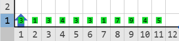
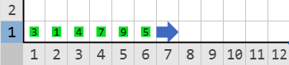

# CÓDIGOS ÚNICOS

Al entrar a la base, Karel se encuentra en un gran salón. Al fondo del salón se observa un pasillo y luz que brilla del otro lado. Sobre el pasillo hay una inscripción con letras brillantes: "Sólo pasarán por aquí aquellos cuyo código sea óptimo..."

Reflexionando sobre la inscripción, Karel piensa que a lo largo de su vida ha escrito cientos de veces códigos similares. Decidido a no repetir códigos de forma innecesaria, Karel decide hacer una biblioteca de códigos únicos que usará en sus problemas futuros.

Karel revisa todos los códigos que ha escrito y a cada uno le asigna un número. Si dos códigos hacen lo mismo, tendrán el mismo número, luego pone montones de zumbadores que representan los números de todos sus códigos en la primera fila del mundo.

Karel desea quedarse con sólo una copia de cada código. Escribe un programa que le ayude a depurar su lista y dejar únicamente una copia de cada número.

## Problema

La primera fila del mundo de Karel contiene una lista de números que representan los códigos de Karel. No hay espacios entre los números, no tienen ningún orden en particular y puede haber números repetidos.

Escribe un programa que elimine todos los números repetidos de la lista dejando sólo una copia de cada uno y deje esta nueva lista en la fila uno a partir de la primera columna y sin espacios entre los números. No importa el orden de los números en la lista final.

Además de la lista final, no debe quedar ningún otro zumbador en el mundo.

## Ejemplo

Entrada:

Salida:

#### Descripción del ejemplo

En la lista de códigos de Karel se repite varias veces el código 3, el 1 y el 4. Karel debe eliminar las copias extras de estos códigos y dejar una lista final que tenga únicamente una copia de cada código distinto. Además, debe eliminar el resto de los zumbadores del mundo.

## Consideraciones

* Karel inicia en la posición (1, 1) viendo al norte.
* Karel lleva infinitos zumbadores en la mochila.
* La primera fila del mundo contiene montones de zumbadores que representan los números asignados a los códigos.
* No hay espacios entre los montones y estos pueden llegar hasta la pared este del mundo.
* El mundo de Karel tiene 100 columnas de ancho.
* Los montones de zumbadores pueden ir del 1 al 999.
* El mundo puede tener una altura que va desde 1 hasta 100.
* Para obtener los puntos, tu programa deberá dejar una lista de números en la primera fila y a partir de la primera columna en la que aparezcan todos los números distintos de la lista original sin ningún número repetido.

## Subtareas

En este problema, los casos de cada subtarea se encuentran agrupados. Para obtener el puntaje de una subtarea deberás resolver correctamente todos los casos del grupo.

* **Subtarea 1 (50 puntos):** Los valores de la lista van en orden ascendente.
* **Subtarea 2 (50 puntos):** Sin consideraciones adicionales. Además, para obtener los puntos de esta subtarea tu programa debe ejecutar la instrucción `coge-zumbador` un número de veces menor o igual a la suma de todos los números de la lista.